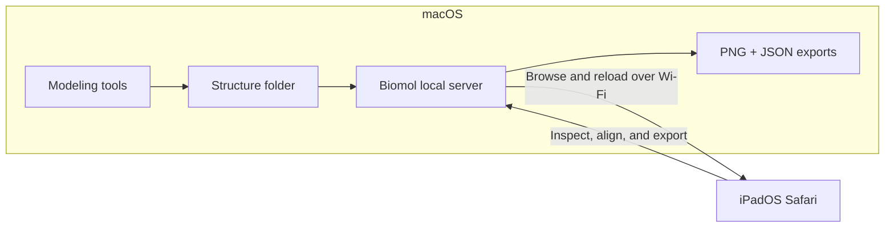

# Biomol Viewer

English | [简体中文](README.zh-CN.md)

Biomol Viewer turns a Mac and an iPad into one molecular-structure workspace.
The Mac generates, stores, and serves PDB/mmCIF files; the iPad provides the
touch-first viewer in Safari. It uses neither screen mirroring nor an extended
display.

The current release is **1.6.0**. It supports English and Simplified Chinese.

**Start here:** [run the first session](#first-session-on-mac-and-ipad) ·
[share a structure folder](#share-structures-from-the-mac) ·
[align two structures](#superposition-and-rmsd) ·
[export back to the Mac](#view-controls-and-export)

## Built for macOS + iPadOS



| macOS handles | iPadOS handles |
| --- | --- |
| Generate and organize structure files | Browse the Mac structure library |
| Serve a chosen folder over local Wi-Fi | Rotate, zoom, select, and compare by touch |
| Receive exported PNG images and JSON reports | Align structures and send exports back to the Mac |

This creates a short working loop: generate on the Mac, refresh on the iPad,
inspect or compare, then save the view back to the Mac. Updated files can be
reloaded without rebuilding the app or reopening the scene.

## What you can do

- Open local `.pdb`, `.cif`, and `.mmcif` files, fetch structures from RCSB PDB,
  or browse a folder shared by the Mac.
- Load several structures and control the visibility of each file, chain, and
  molecular component.
- Color protein chains with multiple palettes while rendering ligands, nucleic
  acids, glycans, ions, and water distinctly.
- Select residues or atoms, focus at atomic scale, and show complete residues
  within 5 Å across all visible aligned structures.
- Superpose chains or custom regions using sequence-based or coordinate-only
  correspondence, with RMSD, temporary overlap preview, apply, and undo.
- Export transparent PNG images and matching scene metadata to the Mac.
- Use a bundled gallery of typical protein, ligand, complex, RNA, and DNA
  examples without an internet connection.

## Requirements

- **Mac:** macOS with Node.js 22 or newer and npm
- **iPad:** iPadOS with WebGL-capable Safari; nothing is installed on the iPad
- **Network:** both devices on the same trusted, non-isolated Wi-Fi network

## First session on Mac and iPad

On the Mac, clone the project and run these commands from the repository root:

```sh
npm ci
npm run build
npm start
```

The server prints two kinds of address:

- `http://localhost:5173/` opens the viewer on the Mac.
- A **Network** address such as `http://192.168.1.7:5173/` opens it from another
  device on the same local network.

Connect the iPad to the same Wi-Fi, open the **Network** address in Safari, and
keep the Mac awake while viewing. The molecular scene is rendered by the iPad;
the Mac only serves the app and the files you choose to share.

If the page does not open, confirm that both devices are on the same non-isolated
network and that macOS allows incoming connections for Node.js.

For development with automatic browser refresh, use `npm run dev` instead. It
prints the same kind of local-network address.

## Share structures from the Mac

By default, the server shares the repository's `shared-structures/` folder.

1. Save or copy `.pdb`, `.cif`, or `.mmcif` files into `shared-structures/`.
   Subfolders are supported.
2. On the iPad, choose **+ Open → Mac library → Refresh**.
3. Tap a structure to add it to the scene.
4. After updating the same file on the Mac, choose **Files → Reload** on the
   iPad. A parsing failure leaves the previous structure usable.

To share an existing output folder, provide its absolute path when starting the
server:

```sh
BIOMOL_LIBRARY="/Users/yourname/path/to/structures" npm start
```

Folder changes appear after **Refresh** or **Reload**. Restart the server only
when changing the configured folder.

You can configure the export folder at the same time:

```sh
BIOMOL_LIBRARY="/Users/yourname/structures" \
BIOMOL_EXPORTS="/Users/yourname/figures" \
npm start
```

## Opening structures

The **+ Open** dialog provides four sources:

- **From this device** uses the browser's native file picker. Device-local
  structures stay in that browser.
- **RCSB PDB** accepts a four-character PDB ID such as `4HHB`, as well as an
  extended PDB ID. This option requires internet access.
- **Examples by scenario** contains bundled monomer, protein-ligand,
  homo/heteromer, protein-RNA, and protein-DNA structures.
- **Mac library** reads files explicitly placed in the shared Mac folder.

Opening another source adds it to the current scene. Files retain their original
coordinates until they are aligned.

## Inspecting and managing a scene

Use **Files** to show or hide complete structures, protein chains, water,
ligands, nucleic acids, and other component groups. The panel also provides
structure fitting, duplication, removal, representation modes, chain palettes,
and residue/atom picking modes.

Drag to rotate, pinch to zoom, and use **Reset view** to fit the visible scene.
**Purge all structures** clears the browser scene and alignment history without
deleting Mac source files or saved exports.

Protein chains use colored cartoons. DNA, RNA, and ligands use element-colored
ball-and-stick representations with contrasting carbon colors; glycans use
carbohydrate symbols; ions use spheres. Water starts hidden.

For close inspection:

1. Tap a residue and choose **Nearby atoms · 5 Å**. The viewer shows complete
   nearby residues from every open file and checked chain, using the structures'
   current aligned coordinates. The selection panel reports atom and file counts.
2. For a specific atom, choose **Files → Tap selects → Atom**, tap atom geometry,
   and choose **Focus**.
3. Choose among **Cartoon**, **Cartoon + sticks**, **Backbone**, **Lines**,
   **Ball + stick**, **Space filling**, and **Molecular surface**. Use a style
   with atom geometry when the required atom is not visible in a cartoon.

Nearby atoms is a geometric proximity view; it does not classify hydrogen bonds
or other chemical interactions. **Clear selection** removes the temporary view.

## Superposition and RMSD

Choose **Align** after opening structures. The default workflow aligns one chain
to another:

1. Select the fixed reference structure and chain.
2. Select the mobile structure and chain.
3. Choose **Preview fit** to calculate correspondence and RMSD, or hold
   **Preview overlap** to inspect a temporary translucent superposition.
4. Choose **Apply alignment** to move the complete mobile file. Use
   **Undo last alignment** to restore its previous transform.

Whole-chain sequence alignment is the default. Either counterpart can be
restricted with author residue ranges or a selection captured from the canvas.
Protein fits use Cα atoms; nucleic-acid fits use C4′ atoms.

Use **Coordinates only** for sequence-independent matching. It tolerates unequal
residue counts and gaps within bounded search limits. With exactly two files
open, **Quick align two files** selects a compatible chain pair and applies the
fit immediately. Always review coverage and correspondence for repetitive or
highly symmetric structures.

Detailed behavior and numerical limits are documented in
[Superposition and RMSD](docs/alignment.md).

## View controls and export

- **中文 / EN** changes the interface language and remembers the choice in the
  current browser.
- **Files → Auto view · Beta** samples visible atoms to find an orientation with
  less projected overlap. **Undo view** restores the previous camera without
  changing structure coordinates.
- **Export → Save PNG to Mac** writes a PNG with transparency enabled by default,
  plus a JSON report containing camera, visibility, transform, file-label, and
  latest-alignment data.

Exports are saved in `scene-exports/`. To choose another directory:

```sh
BIOMOL_EXPORTS="/Users/yourname/path/to/exports" npm start
```

The JSON report records the scene but is not currently a reloadable scene file.
See [Scene image export](docs/export.md) for details.

## Privacy and network scope

Device-local files are parsed in the browser and are not uploaded to the Mac or
to RCSB. RCSB requests go directly from the browser to the official RCSB download
service.

The Mac library is read-only. It serves only PDB/mmCIF files inside the configured
folder, skips hidden files and symlinks, and provides no delete or upload API.
Scene export is a separate workflow that writes generated PNG/JSON pairs.

The standalone server is intended for a trusted local network and does not
provide authentication. Anyone who can reach it can read the files in the shared
structure folder. Do not expose it directly to the public internet.

## Development

| Command | Purpose |
| --- | --- |
| `npm run dev` | Start the Vite development server on the local network |
| `npm run build` | Type-check and build the browser app and standalone server |
| `npm start` | Run the built standalone server without Vite |
| `npm run serve` | Build, then start the standalone server |
| `npm test` | Run unit tests |
| `npm run lint` | Run ESLint |
| `npm run typecheck` | Run TypeScript checks |
| `npm run test:e2e` | Run Chromium and WebKit browser tests |
| `npm run test:runtime` | Test the built dependency-free server |
| `npm run clean` | Remove caches, reports, and TypeScript build state |
| `npm run compact` | Rebuild, then remove `node_modules` and generated caches |

Install Playwright browsers before the first end-to-end test run:

```sh
npx playwright install chromium webkit
npm run test:e2e
```

Browser tests exercise real molecular rendering, canvas selection, Mac-library
access, alignment, and exports. Run `npm ci` to restore development dependencies
after `npm run compact`.

## Compact standalone runtime

`npm run build` bundles the browser application and a Node server into `dist/`.
Afterward, `npm start` requires Node.js and `dist/`, but does not require
`node_modules`.

Use `npm run compact` when you want a small working directory for routine iPad
use. It preserves source files, the built application, Git history, shared
structures, and saved exports. A clean checkout currently occupies about 12 MB
after compaction; dependency size varies by platform and npm version.

## Architecture and current limits

React owns the touch interface, while Mol* 5.11.0 owns parsing, molecular
representations, picking, and camera control. The Mol* integration is isolated in
`src/viewer/`; `server/library.ts` and `server/exports.ts` provide the Mac
filesystem boundary. See [Application / Mol* boundary](docs/architecture.md).

The first coordinate model is loaded. Biological assemblies and trajectories are
not expanded. Scene state does not persist through a page refresh, and exported
JSON cannot yet restore a scene. PWA installation, cloud storage, and annotations
are outside the current release.

A static host can serve `dist/` for device-file loading and RCSB access. The Mac
library and Mac export features require the included Node server or the Vite
development server.

## License

Biomol Viewer is available under the [MIT License](LICENSE).

## Documentation

- [Bundled examples and provenance](docs/examples.md)
- [Superposition and RMSD](docs/alignment.md)
- [Language and view controls](docs/view-and-language.md)
- [Scene image export](docs/export.md)
- [Architecture](docs/architecture.md)
- [Physical iPad release checklist](docs/ipad-testing.md)
- [Milestone record](docs/milestones.md)

The original physical-iPad-tested release is preserved by the `v1.0.0` Git tag.
Version 1.5.0 adds the Biomol branding, flat project layout, compact standalone
runtime, and cross-file nearby-atom inspection. Version 1.6.0 adds backbone,
line, space-filling, and molecular-surface protein styles.
