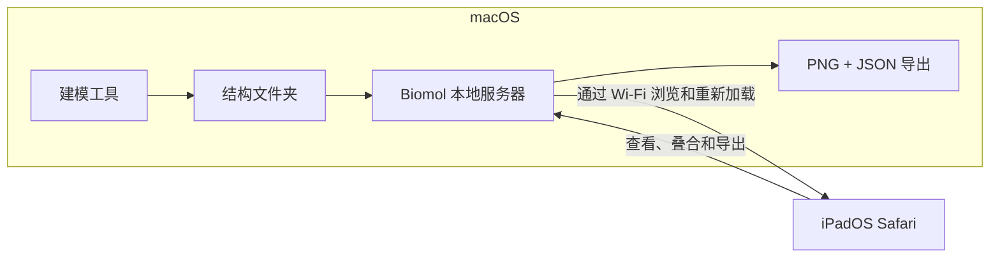

# Biomol Viewer

[English](README.md) | 简体中文

Biomol Viewer 将 Mac 和 iPad 组合成一个分子结构工作空间。Mac 负责生成、
保存和提供 PDB/mmCIF 文件，iPad 则通过 Safari 提供触控优先的结构查看器。
整个过程无需屏幕镜像，也不用把 iPad 作为扩展屏幕。

当前版本为 **2.0.0**，界面支持英文和简体中文。

**快速导航：** [首次运行](#在-mac-和-ipad-上首次运行) ·
[共享结构文件夹](#从-mac-共享结构) · [叠合两个结构](#结构叠合与-rmsd) ·
[导出到 Mac](#视角控制与导出)

## 为 macOS + iPadOS 协作而设计



| macOS 负责 | iPadOS 负责 |
| --- | --- |
| 生成和整理结构文件 | 浏览 Mac 结构文件库 |
| 通过本地 Wi-Fi 提供指定文件夹 | 通过触控旋转、缩放、选择和比较 |
| 接收导出的 PNG 图像和 JSON 报告 | 叠合结构并将导出结果保存回 Mac |

这个工作流很直接：在 Mac 上生成结构，在 iPad 上刷新并查看或比较，然后将
视图保存回 Mac。结构文件更新后，可以直接重新加载，无需重新构建应用或重开
整个场景。

## 主要功能

- 打开本地 `.pdb`、`.cif` 和 `.mmcif` 文件，从 RCSB PDB 获取结构，或浏览
  Mac 共享的文件夹。
- 同时加载多个结构，并控制每个文件、链和分子组件的可见性。
- 使用七套带色谱预览的配色区分蛋白质链；同一次会话不重复链颜色，同时清晰
  区分配体、核酸、糖链、离子和水。
- 在“快速讨论”“专业演示”和“报告发表”场景预设间切换，并可按需在结构视图
  上显示简洁的文件名和链标签。
- 按链、元素、氨基酸类型、二级结构、疏水性、电荷、置信度或自定义残基/原子
  标量进行配色。
- 注释口袋、表位、抗原结合位、活性位点或自定义残基集合，并在关联的序列、
  二级结构和置信度轨道中查看。
- 通过触控选择测量距离、夹角、二面角、RMSD、半径和近似埋藏界面面积。
- 选择残基或原子，进行原子级聚焦，并显示所有已叠合可见结构中 5 Å 范围内的
  完整残基。
- 使用基于序列或仅基于坐标的对应关系叠合整条链或自定义区域，并提供 RMSD、
  临时重叠预览、应用和撤销。
- 将透明背景 PNG 和配套场景元数据导出到 Mac。
- 无需联网即可使用内置的蛋白质、配体、复合物、RNA 和 DNA 典型示例。

## 运行要求

- **Mac：**macOS、Node.js 22 或更高版本，以及 npm
- **iPad：**iPadOS 和支持 WebGL 的 Safari；iPad 无需安装任何软件
- **网络：**两台设备连接到同一个可信且未启用客户端隔离的 Wi-Fi 网络

## 在 Mac 和 iPad 上首次运行

在 Mac 上克隆项目，然后从仓库根目录运行：

```sh
npm ci
npm run build
npm start
```

服务器会输出两类地址：

- `http://localhost:5173/` 用于在 Mac 上打开查看器。
- 类似 `http://192.168.1.7:5173/` 的 **Network** 地址，可供同一局域网内的
  其他设备访问。

将 iPad 连接到同一个 Wi-Fi，在 Safari 中打开 **Network** 地址，并在使用期间
保持 Mac 唤醒。分子场景由 iPad 自己渲染；Mac 只负责提供应用和你明确共享的
文件。

如果页面无法打开，请确认两台设备位于同一个未隔离的网络，并确认 macOS 允许
Node.js 接收入站连接。

开发时可使用 `npm run dev` 获得自动浏览器刷新。它也会输出同类局域网地址。

## 从 Mac 共享结构

默认情况下，服务器共享仓库中的 `shared-structures/` 文件夹。

1. 将 `.pdb`、`.cif` 或 `.mmcif` 文件保存或复制到 `shared-structures/`；支持
   子文件夹。
2. 在 iPad 上选择 **＋打开 → Mac 文件库 → 刷新**。
3. 轻点一个结构，将它加入场景。
4. 在 Mac 上更新同名文件后，在 iPad 上选择 **文件 → 重新加载**。如果新文件
   解析失败，原有结构仍可继续使用。

如需直接共享已有的输出文件夹，请在启动服务器时提供绝对路径：

```sh
BIOMOL_LIBRARY="/Users/yourname/path/to/structures" npm start
```

文件夹内容变化后，只需使用 **刷新** 或 **重新加载**。只有更改共享文件夹配置时
才需要重启服务器。

也可以同时指定导出文件夹：

```sh
BIOMOL_LIBRARY="/Users/yourname/structures" \
BIOMOL_EXPORTS="/Users/yourname/figures" \
npm start
```

## 打开结构

**＋打开** 窗口提供四种来源：

- **从此设备选择** 使用浏览器的原生文件选择器。设备本地结构始终留在该浏览器
  中。
- **从 RCSB PDB 获取** 接受 `4HHB` 这样的四字符 PDB 编号，也支持扩展 PDB
  编号；此选项需要联网。
- **按场景选择示例** 提供内置的单体、蛋白质–配体、同源/异源复合物、
  蛋白质–RNA 和蛋白质–DNA 结构。
- **Mac 文件库** 读取明确放入 Mac 共享文件夹的结构。

每次打开都会把结构加入当前场景。结构在执行叠合前保留原始坐标。

## 查看与管理场景

使用 **文件** 面板显示或隐藏完整结构、蛋白质链、水、配体、核酸及其他组件。
该面板还提供适合视图、复制、移除、显示方式、链配色和残基/原子选择模式。

拖动可旋转，双指捏合可缩放，**重置视角** 会让可见场景重新适合屏幕。
**清空所有结构** 会清除浏览器中的场景和叠合历史，但不会删除 Mac 源文件或
已经保存的导出。

蛋白质链显示为彩色卡通。DNA、RNA 和配体使用按元素配色的球棍模型，并为碳
原子使用对比色；糖链使用糖类符号，离子使用球体。水默认隐藏。

进行局部细节查看：

1. 轻点一个残基，然后选择 **附近原子 · 5 Å**。查看器会依据结构当前的叠合
   坐标，显示所有已打开文件和已勾选链中的完整邻近残基。选择面板会报告原子数
   和参与的文件数。
2. 如需查看特定原子，选择 **文件 → 轻点选择 → 原子**，轻点可见原子后选择
   **聚焦**。
3. 可以选择 **卡通**、**卡通 + 棒状**、**骨架**、**线框**、**球棍**、
   **空间填充** 和 **分子表面**。如果目标原子未显示在卡通模型中，请使用带有
   原子几何形状的样式。

“附近原子”仅表示几何距离，并不会判定氢键或其他化学相互作用。**清除选择**
会移除这一临时视图。

## 结构叠合与 RMSD

打开结构后选择 **叠合**。默认工作流将一条链叠合到另一条链：

1. 选择保持固定的参考结构和参考链。
2. 选择需要移动的结构和链。
3. 选择 **计算叠合** 计算对应关系与 RMSD，或按住 **预览重叠** 临时查看半透明
   叠合效果。
4. 选择 **应用叠合** 移动整个待叠合文件；使用 **撤销上次叠合** 恢复其先前
   变换。

默认使用整链序列比对。任意一侧都可以通过作者残基编号范围或从画布捕获的选择
限制区域。蛋白质使用 Cα 原子拟合，核酸使用 C4′ 原子。

如果序列不可靠，可使用 **仅坐标** 进行独立于序列的匹配。它在有限搜索范围内
允许残基数不同和存在间隙。恰好打开两个文件时，**快速叠合两个文件** 会选择
兼容的链对并立即应用拟合。对于重复或高度对称的结构，请始终检查覆盖率和残基
对应关系。

详细方法和数值限制请参阅[结构叠合与 RMSD（英文）](docs/alignment.md)。

## 视角控制与导出

- **中文 / EN** 切换界面语言，并在当前浏览器中记住选择。
- **文件 → 自动视角 · 测试版** 对可见原子采样，以寻找投影重叠较少的方向。
  **撤销视角** 恢复上一个相机视角，不会改变结构坐标。
- **导出 → 保存 PNG 到 Mac** 会写入 PNG；默认启用透明背景。同时生成 JSON
  报告，记录相机、可见性、变换、文件标签和最近一次叠合。

导出文件保存在 `scene-exports/`。如需更改位置：

```sh
BIOMOL_EXPORTS="/Users/yourname/path/to/exports" npm start
```

JSON 报告记录场景状态，但目前不能用于重新加载场景。详细说明请参阅
[场景图像导出（英文）](docs/export.md)。

## 隐私与网络范围

设备本地文件在浏览器内解析，不会上传到 Mac 或 RCSB。RCSB 请求由浏览器直接
发送到 RCSB 官方下载服务。

Mac 文件库为只读。它只提供配置文件夹内的 PDB/mmCIF 文件，跳过隐藏文件和
符号链接，也不提供删除或上传 API。场景导出是单独的流程，只写入生成的
PNG/JSON 文件对。

独立服务器仅为可信局域网设计，不提供身份验证。任何能够访问服务器的设备都能
读取共享结构文件夹中的文件。请勿将服务器直接暴露到公网。

## 开发

| 命令 | 用途 |
| --- | --- |
| `npm run dev` | 在局域网上启动 Vite 开发服务器 |
| `npm run build` | 执行类型检查并构建浏览器应用和独立服务器 |
| `npm start` | 不依赖 Vite，运行已经构建的独立服务器 |
| `npm run serve` | 构建后启动独立服务器 |
| `npm test` | 运行单元测试 |
| `npm run lint` | 运行 ESLint |
| `npm run typecheck` | 运行 TypeScript 检查 |
| `npm run test:e2e` | 运行 Chromium 和 WebKit 浏览器测试 |
| `npm run test:runtime` | 测试构建后的无依赖服务器 |
| `npm run clean` | 移除缓存、测试报告和 TypeScript 构建状态 |
| `npm run compact` | 重新构建，然后移除 `node_modules` 和生成的缓存 |

首次运行端到端测试前，请安装 Playwright 浏览器：

```sh
npx playwright install chromium webkit
npm run test:e2e
```

浏览器测试覆盖真实分子渲染、画布选择、Mac 文件库访问、结构叠合和场景导出。
运行 `npm run compact` 后，可通过 `npm ci` 恢复开发依赖。

## 精简的独立运行环境

`npm run build` 将浏览器应用和 Node 服务器打包到 `dist/`。构建完成后，
`npm start` 只需要 Node.js 和 `dist/`，不需要 `node_modules`。

日常在 iPad 上使用时，可运行 `npm run compact` 缩小工作目录。它会保留源文件、
构建后的应用、Git 历史、共享结构和已保存导出。精简后的干净工作目录当前约为
12 MB；依赖大小会随平台和 npm 版本变化。

## 架构与当前限制

React 负责触控界面，Mol* 5.11.0 负责解析、分子显示、拾取和相机控制。Mol*
集成集中在 `src/viewer/`，`server/library.ts` 和 `server/exports.ts` 构成 Mac
文件系统边界。详见[应用与 Mol* 的边界（英文）](docs/architecture.md)。

目前只加载第一个坐标模型，不展开生物学组装体或轨迹。刷新页面后场景状态不会
保留，导出的 JSON 也暂时不能恢复场景。PWA 安装、云存储和标注不在当前版本
范围内。

静态托管可以提供 `dist/`，用于打开设备本地文件和访问 RCSB。Mac 文件库与
Mac 导出功能需要使用附带的 Node 服务器或 Vite 开发服务器。

## 许可证

Biomol Viewer 使用 [MIT 许可证](LICENSE)。

## 文档

- [内置示例与来源（英文）](docs/examples.md)
- [结构叠合与 RMSD（英文）](docs/alignment.md)
- [语言与视角控制（英文）](docs/view-and-language.md)
- [配色、注释、序列关联与测量（英文）](docs/analysis.md)
- [场景图像导出（英文）](docs/export.md)
- [架构（英文）](docs/architecture.md)
- [实体 iPad 发布检查清单（英文）](docs/ipad-testing.md)
- [里程碑记录（英文）](docs/milestones.md)

最初通过实体 iPad 测试的版本由 Git 标签 `v1.0.0` 保存。1.5.0 版本加入 Biomol
品牌、扁平化项目结构、精简的独立运行环境，以及跨文件附近原子查看。1.6.0
版本加入骨架、线框、空间填充和分子表面等蛋白质显示样式。1.7.0 版本加入适合
讨论、演示和报告的场景预设、配色色谱预览、会话内不重复的链颜色，以及可选的
文件名/链标签。
2.0.0 版本加入关联分析工作区，包括属性配色、残基注释、序列轨道与结构测量。
